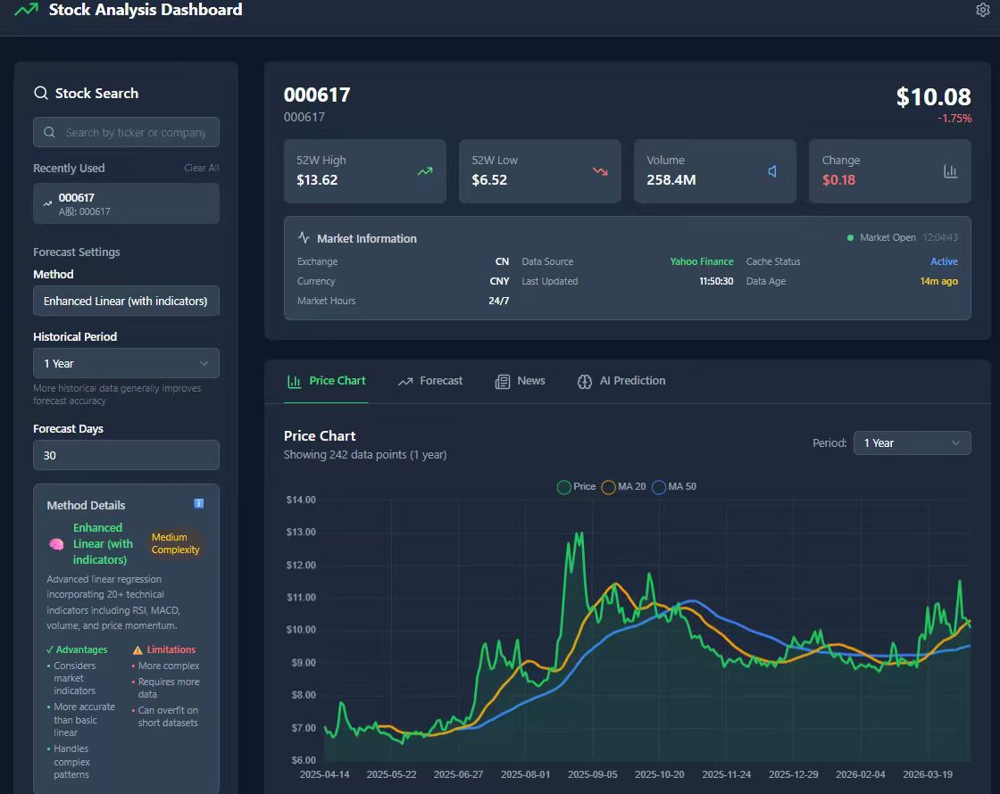
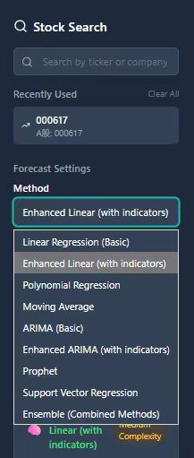
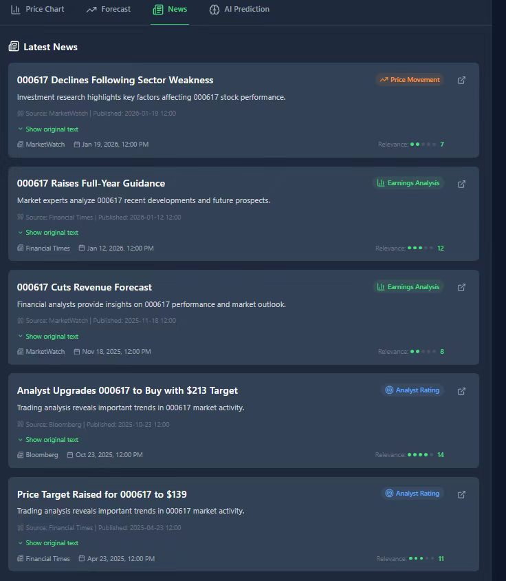
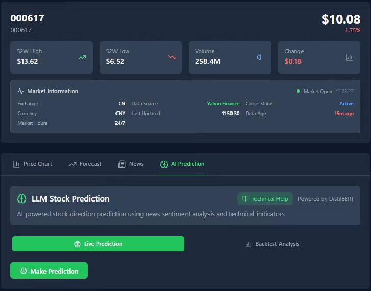

# 智能股票量化分析系统技术报告

## 第一部分：前端界面结构与组件设计

### 一、前端界面结构与组件设计

本项目的前端部分定位为股票分析系统的人机交互入口与可视化呈现层，其核心任务并不是简单完成页面搭建，而是围绕股票查询、行情展示、预测结果呈现与资讯浏览等功能，构建一套结构清晰、交互连贯、适配多终端的单页式可视化界面。从仓库结构和项目说明可以看出，系统前端采用 React 19、TypeScript、Tailwind CSS 与 Chart.js 作为主要技术栈，并与 FastAPI 后端形成前后端分离的实现模式，前端主要负责状态管理、组件组织、界面渲染以及与后端接口的数据交互。

从工程组织方式来看，前端代码集中位于 frontend/src/ 目录下，整体采用典型的单页应用组织思路。其中，components/ 目录承担业务组件封装职责，用于放置股票搜索、行情图表、预测图表、指标卡片和新闻模块等核心界面单元；App.tsx 作为根组件负责页面装配、主状态维护和主布局控制；仓库说明中也明确给出了前端属于 React + TypeScript + Tailwind CSS + Chart.js 的技术架构。这种目录划分方式使界面层、组件层与数据调用逻辑保持了较好的分离度，便于后续维护与功能扩展。

在页面结构设计上，本项目并未采用多页面路由跳转模式，而是围绕单页 Dashboard 进行统一组织。App.tsx 中通过 grid grid-cols-1 lg:grid-cols-4 gap-8 形成响应式主布局，在大屏状态下将页面划分为左侧控制区与右侧展示区两部分，其中左侧主要用于股票搜索与预测参数设置，右侧则负责行情总览、指标展示、图表分析、新闻列表以及预测结果输出。与此同时，系统顶部保留了统一的标题栏，用于展示平台名称与系统设置入口，从而形成“顶部导航 + 左侧控制面板 + 右侧内容区域”的稳定界面框架。

图1：系统主界面展示了股票搜索、行情指标、价格图表、预测设置和标签页布局。

在响应式适配方面，项目依托 Tailwind CSS 的栅格与断点机制实现了从桌面端到平板端、移动端的自适应切换。当前布局在默认状态下采用单列堆叠，在 lg 级别断点下自动切换为四列网格，并通过左侧一列、右侧三列的比例突出主要数据内容区域。这种布局策略兼顾了桌面端的信息承载能力与小屏设备的可读性，避免了传统金融信息看板在移动端出现的组件拥挤、层次混乱和交互不连续问题。仓库 README 也明确将 “Responsive Design” 作为项目特性之一，说明该前端在设计目标上就强调多终端可用性。

从前端状态管理角度看，系统并未引入 Redux、MobX 等额外状态库，而是直接在 App.tsx 中以 React Hooks 维护核心页面状态。源码显示，页面集中管理了 selectedTicker、stockData、forecastData、newsData、activeTab、forecastMethod、forecastDays、period 和 selectedNewsIndex 等关键变量。其中，selectedTicker 用于标识当前股票对象，stockData 和 newsData 分别对应基础行情与新闻数据，forecastData 则承载预测结果，activeTab 用于切换价格图、预测图、新闻和 AI 预测等不同显示面板。这种以根组件集中调度状态的方式，使单页应用内部的数据流向较为清晰，也降低了组件间通信成本。

进一步分析数据流转逻辑可以发现，本项目将“基础行情数据”和“预测结果数据”拆分为两条相对独立的请求链路。源码中，系统在股票代码和历史区间确定后，通过 getStockData(selectedTicker, period) 获取行情数据，并继续调用 getNews(selectedTicker, 5, period) 拉取相关新闻；而预测结果则通过另一条独立链路 getForecast(selectedTicker, period, forecastDays, forecastMethod) 进行请求，并根据预测天数和预测方法的变化进行重新拉取。这样的设计有助于降低高计算量预测请求对基础页面展示的干扰，也使图表浏览、新闻查看与预测分析能够保持相对独立的刷新节奏。

在核心组件设计方面，StockSearch 组件承担了前端交互入口的职责。该组件对外通过 onStockSelect 回调向父组件返回用户选中的股票代码，对内则维护 query、suggestions、loading、showSuggestions 和 recentStocks 等局部状态。源码显示，组件在首次加载时会通过 localStorage.getItem('recentStocks') 读取最近搜索记录，并在输入长度达到 2 个字符后才触发搜索接口调用，以减少无效请求和输入抖动。由此可见，StockSearch 并非简单输入框，而是集成了输入校验、建议项渲染、本地缓存与用户历史记录管理等多项功能。

图2：左侧控制面板集中承载股票搜索、最近使用记录、预测方法、历史周期和预测天数设置。

StockChart 组件是前端数据可视化的核心模块之一，其输入数据包括日期序列以及开盘价、最高价、最低价、收盘价和成交量等行情字段，同时还可以接收新闻数据与新闻高亮索引，用于实现图表与资讯的联动显示。需要说明的是，项目 README 虽然将 “candlestick charts” 作为特性进行介绍，但当前前端源码中的 StockChart 实际是基于 react-chartjs-2 的 Line 组件进行渲染，并在组件内部通过 calculateMA 函数计算 MA20 与 MA50 两条均线，再叠加到收盘价曲线上。因此，就当前实现而言，前端更准确的表达应是“价格折线图 + 均线分析”，而非严格意义上的 K 线烛图。

除了基础价格曲线的绘制之外，StockChart 还引入了 chartjs-plugin-annotation 插件，用于将新闻事件映射到时间轴位置上，并通过高亮标注增强图表的事件解释能力。源码中，组件会根据新闻发布时间寻找最接近的图表日期索引，再在图中插入垂直高亮线；同时在 tooltip 的 afterBody 回调中，还会补充对应时间附近的新闻标题与摘要。这样的处理使价格波动与市场资讯之间形成了更直观的关联关系，也提升了图表作为分析工具而非单纯展示工具的解释能力。

与历史行情展示对应，ForecastChart 组件承担了预测结果可视化的职责。该组件将历史价格数据与未来预测结果拼接到同一坐标系中，通过颜色与线型差异区分真实历史曲线和模型预测曲线。源码中可以看到，组件在渲染前会先检查 historicalData.dates、historicalData.close 与 forecastData.predictions 是否存在，以避免接口返回不完整数据时直接触发渲染异常。这种“先校验再绘图”的处理方式提高了前端对异常数据的容错能力，也保证了预测图表能够在多模型切换时保持较稳定的显示效果。

StockMetrics 组件主要承担关键行情指标的结构化展示任务。根据源码，该组件会以卡片化方式展示 52 周最高价、52 周最低价、成交量以及价格变化等核心指标，并对数值进行货币格式化和颜色区分处理，以便用户快速识别当前股票的总体运行状态。特别是在价格变化项上，组件根据涨跌方向动态设置正负号与颜色，这种细节虽然实现简单，但对于金融场景下的信息辨识效率提升较为明显。

NewsSection 组件则负责新闻信息的列表式呈现。该组件按照新闻条目逐条渲染标题、摘要、来源、发布时间等内容，并通过 expandedArticles 集合维护文章展开与收起状态。当新闻对象中存在 original_text 字段时，组件支持进一步展开显示更完整文本；若接口未返回任何新闻数据，则会向用户显示“No news articles available at the moment.”的空状态提示。由此可见，该组件不仅完成了基础的信息罗列，同时也兼顾了内容层级控制和异常状态反馈。

图3：新闻资讯模块展示新闻标题、摘要、来源、发布时间、相关度评分和展开按钮。

从页面交互组织角度看，项目采用 Tab 切换机制在单页内部完成不同分析视图之间的转场。activeTab 被定义为 'chart' | 'forecast' | 'news' | 'llm' 四种状态，对应价格图、预测图、新闻和 AI 预测四类内容模块。这一设计避免了页面跳转带来的上下文中断，使用户在同一股票对象下即可快速切换不同分析维度，提高了单页看板在连续使用场景中的操作效率。这种 Tab 化组织方式也有利于在有限页面空间内同时容纳行情、资讯与模型结果。

综合来看，本项目前端在界面结构与组件设计上呈现出较为鲜明的工程化特征：其一，采用单页 Dashboard 作为整体载体，使控制区和展示区在布局层面保持稳定；其二，通过组件化方式拆分出搜索、图表、预测、指标和新闻等功能单元，使界面逻辑边界较为清晰；其三，以 App.tsx 为中心维护核心状态，并通过相对独立的数据请求链路组织基础数据与预测数据，保证了界面的响应效率与功能可扩展性；其四，在可视化层面基于 Chart.js 实现了价格曲线、均线叠加、注释高亮与预测拼接等功能，使前端不仅具备展示能力，也具备一定的分析辅助能力。总体而言，该前端实现已经形成了较完整的股票分析界面框架，为后续继续扩展真实 K 线渲染、更细粒度状态管理以及更复杂的交互分析功能奠定了基础。

## 第二部分：前端数据交互与状态管理

### 前端数据交互与状态管理 — 技术实现总结

### 一、项目前端技术栈概述

本项目前端基于 React 19 + TypeScript 4.9 构建，使用 Create React App 作为项目脚手架。数据可视化采用 Chart.js 4.5 配合 react-chartjs-2 5.3 封装层，并引入 chartjs-plugin-annotation 3.1 实现图表上的新闻事件标注功能。HTTP 请求通过 Axios 1.11 完成，样式层面使用 Tailwind CSS 3.4 原子化方案，图标使用 Lucide React 0.542 库。

整个前端架构的核心特点是：不依赖 Redux、Context 等全局状态管理方案，而是完全基于 React 本地 State 与 Hooks 实现复杂的多数据源状态管理。这种轻量化架构在项目规模适中的情况下，既降低了学习成本和代码复杂度，又保证了数据流的清晰可追踪。TypeScript 在项目中提供了完整的类型约束，共定义了 8 个核心接口类型（StockData、ForecastData、NewsArticle、SearchResult、LLMPredictionData、LLMBacktestData、LLMResponse 及技术指标子类型），覆盖了所有 API 返回值、组件 Props 和 State，使得数据结构错误能在编译阶段被捕获，而非在运行时才暴露。

### 二、前端状态管理

#### 2.1 状态架构设计

App.tsx 作为项目的状态管理中心，共使用了 11 个 useState，可按职责划分为三大类：

第一类：数据状态。 包括 stockData（历史行情数据，类型为 StockData | null）、forecastData（AI 预测结果，类型为 ForecastData | null）、newsData（新闻列表，类型为 NewsArticle[]）。这三个状态分别对应后端三个核心接口的返回数据，是页面内容渲染的数据基础。

第二类：UI 与交互状态。 包括 loading（全局加载态，布尔类型）、error（错误信息，string | null）、activeTab（当前标签页，取值为 'chart' | 'forecast' | 'news' | 'llm'）、selectedNewsIndex（当前选中的新闻索引，用于图表标注高亮联动）。这些状态控制着页面的视觉呈现和用户交互反馈。

第三类：控制与配置状态。 包括 selectedTicker（当前选中的股票代码）、forecastMethod（预测算法，支持 9 种方法）、forecastDays（预测天数，范围 7-365）、period（历史数据周期）、currentTime（实时时钟，每秒更新一次）。这些状态作为各类请求的参数，其变化会通过 useEffect 钩子自动触发数据的重新获取。

#### 2.2 Hooks 使用策略

项目在 Hooks 的使用上体现了对 React 渲染机制的深入理解：

当前 `App.tsx` 没有再使用 `useCallback` 包裹请求函数，而是将副作用直接拆分到多个 `useEffect` 中管理。这样做的重点是把“基础数据请求”和“预测数据请求”拆开：基础链路只关心股票代码与历史周期，预测链路额外监听预测天数与预测方法，从而减少不同请求之间的互相干扰。

`useEffect` 主要承担三类职责：第一类监听 `selectedTicker` 与 `period`，用于拉取行情和新闻；第二类监听 `selectedTicker`、`period`、`forecastDays` 与 `forecastMethod`，用于重新生成预测结果；第三类创建每秒执行一次的 `setInterval` 更新时间，并在组件卸载时清理定时器，避免内存泄漏。基础数据和预测数据的 effect 内部都使用 `isMounted` 标记，防止连续切换股票或组件卸载后旧请求覆盖新状态。

#### 2.3 子组件状态管理

除了 App.tsx 的集中式状态管理外，LLMPrediction 组件是唯一拥有独立数据请求逻辑的子组件，内部维护了 7 个独立的 useState：prediction（AI 预测结果）、backtest（回测数据）、loading（局部加载态）、error（局部错误信息）、activeTab（预测/回测切换）、hoveredTooltip（悬浮提示状态）、showTechnicalHelp（帮助弹窗开关）。这种设计使得 AI 模块与主数据流完全解耦，即使 LLM 请求因模型推理耗时过长而超时，也不会影响主页面的正常交互和数据展示。

NewsSection 组件使用了 expandedArticles: Set<number> 来管理多篇新闻的展开/折叠状态，利用 Set 数据结构实现了高效的 O(1) 查找和切换操作。

### 三、前后端接口调用

3.1 Axios 双实例架构

项目在 api.ts 中创建了两个独立的 Axios 实例，这是一个体现工程化思维的重要设计决策：

第一个实例 api 设置超时时间为 10000 毫秒（10 秒），服务于搜索、行情、预测、新闻四个常规接口。这些接口的后端处理逻辑相对简单（数据库查询、API 调用、数值计算），响应时间通常在 1-3 秒内。

第二个实例 llmApi 设置超时时间为 60000 毫秒（60 秒），专门服务于 LLM 预测和回测两个 AI 接口。由于后端使用 DistilBERT 模型进行自然语言推理，加上回测需要对历史数据逐日执行预测计算，单次请求耗时可达 30-60 秒。将两类接口的超时策略分离，避免了 AI 请求因超时策略不匹配而被错误中断的问题。

3.2 四大核心 API 接口详解

/api/search（股票搜索）： 请求方式为 POST，请求体为 { query: string }，传入用户输入的股票代码或公司名称。后端返回一个数组，每个元素包含 ticker（股票代码）、name（公司全名）、exchange（交易所）、type（证券类型）。前端通过 searchStock() 函数调用此接口，将搜索结果展示在下拉搜索列表中。

/api/stock-data（历史行情数据）： 请求方式为 POST，请求体为 { ticker: string, period: string }，传入股票代码和历史数据周期。后端返回一个扁平化的 JSON 对象，包含股票基本信息（名称、交易所、板块）、当前价格与涨跌信息、52 周高低点、成交量，以及一个 data 数组（包含每个交易日的日期、开盘价、最高价、最低价、收盘价、成交量）。前端 getStockData() 函数在接收到原始数据后，执行了一个完整的数据转换过程——这是整个 API 调用层中最具技术亮点的部分。

该数据转换层实现了四个维度的映射：结构转换，将后端的扁平数组 data[i].close 通过 .map() 提取为前端需要的嵌套数组 data.close[]；字段重命名，将后端的驼峰命名 currentPrice 映射为前端蛇形命名 current_price；交易所编码映射，通过映射表将后端返回的简短编码（如 "US"、"UK"）转换为前端展示的全称（如 "NASDAQ"、"LSE"）；多币种格式化，根据后端返回的 currency 字段（USD、GBP、GBp、EUR、JPY），在前端统一处理不同货币符号和小数位数的展示规则。这种 Adapter 模式的数据转换层有效解耦了前后端的数据格式依赖，使得后端接口的格式调整不会直接影响前端组件的渲染逻辑。

/api/forecast（预测数据）： 请求方式为 POST，请求体为 { ticker: string, period: string, forecast_days: number, method: string }。前端提供 9 种预测选项：linear（基础线性回归）、enhanced_linear（Ridge 回归 + 技术指标）、polynomial（多项式回归）、moving_average（移动平均）、arima（基础 ARIMA）、enhanced_arima（SARIMAX + 外部回归量）、prophet（Facebook Prophet）、svr（支持向量回归）、ensemble（加权集成）。其中 `moving_average` 在后端当前实现中通过默认 fallback 进入移动平均预测。后端返回预测方法名、预测数据点数组（日期+价格）、摘要字段，以及普通预测接口当前固定展示的准确度和置信度字段。

/api/news（新闻数据）： 请求方式为 POST，请求体为 { ticker: string, num_articles: number, period: string }。后端返回新闻文章列表，每篇包含标题、摘要、来源、发布时间、原文链接、引用信息、原始文本、文章类型、相关度评分和情感分值。前端 getNews() 函数通过 response.data.articles 提取文章数组后直接存入 newsData 状态。

3.3 三级错误处理机制

项目在 API 调用层实现了精细化的三级错误处理：第一级，当 error.response 存在时，说明服务端返回了错误状态码（如 404 表示未找到股票数据、500 表示服务端内部错误），前端提取状态码和错误详情给用户展示；第二级，当 error.request 存在但 error.response 不存在时，说明请求已经发送但没有收到任何响应，通常意味着后端服务未启动或网络连接中断；第三级，当以上两种情况都不满足时，说明错误发生在请求构造阶段，属于前端代码逻辑问题。这种分级处理确保用户看到的不是笼统的”网络错误”，而是能帮助定位问题的具体信息。

### 四、前端完整数据流程

#### 4.1 主数据流程

用户在搜索框输入股票代码或公司名称后，`StockSearch` 组件通过 `onStockSelect(ticker)` 回调将选中的股票代码传递给 `App.tsx` 的 `handleStockSelect` 函数。当前实现中，`handleStockSelect` 只负责更新 `selectedTicker`，后续的数据加载交给 `useEffect` 根据状态变化自动触发。

随后，基础数据 effect 调用 `getStockData` 获取行情数据，并调用 `getNews` 获取新闻列表；预测数据 effect 调用 `getForecast` 获取预测结果。两条链路相互独立：行情和新闻加载时使用全局 `loading` 与 `error` 状态，预测链路在参数变化时会先清空旧的 `forecastData`，再写入新的预测结果。

数据就绪后，页面根据 activeTab 状态进行条件渲染：chart 标签渲染 StockChart 组件展示价格折线图；forecast 标签渲染 ForecastChart 组件展示历史加预测的双线图；news 标签渲染 NewsSection 组件展示新闻列表；llm 标签渲染 LLMPrediction 组件展示 AI 预测模块。

#### 4.2 参数变更联动

当用户切换历史数据周期 `period` 时，基础数据链路会刷新行情和新闻，预测链路也会基于新周期重新生成预测结果；当用户切换 `forecastMethod` 或调整 `forecastDays` 时，只会触发预测链路刷新，不会重新拉取行情与新闻。这种响应式联动机制确保页面数据始终与用户选择的参数保持一致，同时避免无关接口重复请求。

#### 4.3 LLM 独立子数据流

LLMPrediction 组件维护独立的数据请求链。用户点击”Make Prediction”按钮时，组件调用 llmPredict(ticker, '1mo') 向 /api/llm/predict 发送请求（60 秒超时），根据返回的 response.success 判断成功则将数据存入 prediction 状态，失败则将错误信息存入 error 状态。回测功能同理，调用 llmBacktest(ticker, period) 向 /api/llm/backtest 发送请求。两个操作互相独立，与主页面的数据流也互不干扰。

图4：AI Prediction 模块展示 LLM 股票预测、实时预测入口、回测分析入口和 DistilBERT 标识。

### 五、用户交互逻辑

项目前端共实现了 10 种用户交互操作，每种操作都有明确的事件触发机制、状态更新路径和视觉反馈：

股票搜索： StockSearch 组件接收用户输入，通过回调函数触发 handleStockSelect，更新 selectedTicker；随后基础数据 effect 拉取行情与新闻，预测数据 effect 拉取预测结果，完成页面数据加载。

预测算法选择： 通过 <select> 下拉框的 onChange 事件更新 forecastMethod 状态，预测数据 effect 检测到变化后自动调用 `getForecast()` 获取新算法的预测结果。每种算法配有详细的说明卡片，包含名称、描述、优缺点和复杂度标签，切换时实时更新展示。

预测天数调整： 通过 <input type="number"> 输入框更新 forecastDays 状态，支持 7-365 天范围调整。

历史周期切换： 通过下拉框更新 period 状态，基础数据 effect 刷新行情与新闻，预测数据 effect 同步刷新预测结果，确保图表、指标、新闻和预测都与所选周期一致。

Tab 标签切换： 通过按钮点击更新 activeTab 状态，控制四个内容区域的条件渲染。切换过程为纯前端操作，不触发任何网络请求。

新闻图表标注联动： 用户在新闻列表中点击某篇新闻时，通过 handleNewsSelect(index) 更新 selectedNewsIndex，图表上对应日期的标注点会高亮显示，实现图表与新闻的双向联动。

新闻展开折叠： NewsSection 组件通过 Set<number> 管理每篇新闻的展开状态，点击”Show original text”按钮触发 toggleExpanded 函数，添加或删除对应索引，实现多篇新闻可同时展开的效果。

AI 预测与回测： LLMPrediction 组件内部的两个按钮分别触发 handlePrediction 和 handleBacktest，通过独立的加载态管理和错误处理，为用户提供 AI 预测方向（涨/跌/平）、置信度、技术分析摘要，以及回测的准确率、精确率、召回率、F1 分数和混淆矩阵。

指标 Tooltip 解释： 回测结果页面的 Accuracy、Precision、Recall、F1 Score 四个指标支持鼠标悬浮触发知识卡片，展示定义、计算公式和解读说明，降低了专业术语的理解门槛。

### 六、性能优化分析

6.1 已有的优化措施

请求链路拆分： 当前实现将基础数据和预测数据拆成两个独立的 `useEffect`，并用 `isMounted` 控制旧请求的状态写入权限，避免连续切换参数时出现旧响应覆盖新响应的问题。

Axios 双实例超时分离： 常规接口 10 秒超时、AI 接口 60 秒超时的差异化策略，既保证了普通请求的快速失败反馈，又给予 AI 推理足够的等待时间。

条件渲染与空值保护： App.tsx 中所有数据依赖的渲染区域都通过 {stockData && (...)} 进行空值判断，避免数据未就绪时的渲染崩溃。StockMetrics 组件额外实现了 if (!metrics) 的骨架屏加载渲染，在数据加载期间展示带有脉冲动画的加载状态卡片，保持页面布局稳定。

全方位加载态与异常态处理： 数据加载时展示旋转动画和文字提示；LLM 请求期间展示蓝色信息栏提示”最多需要 60 秒”；接口报错时展示红色错误横幅并附带精确的错误描述；未选择股票时展示欢迎引导页。五种 UI 状态全覆盖，确保用户在任何场景下都能获得清晰的视觉反馈。

### 七、总结

本项目前端在不引入额外状态管理库的前提下，通过 React 原生 Hooks 实现了 11 个 State 的协调管理与响应式联动；通过 Axios 双实例架构和三级错误处理实现了健壮的 API 调用层；通过数据转换层实现了前后端数据格式的优雅解耦；通过 TypeScript 8 接口全量类型覆盖保证了编译期的类型安全；通过条件渲染、骨架屏、加载动画实现了全方位的 UI 状态覆盖。同时，在交互层面支持了 9 种预测算法选择、新闻与图表的联动标注、LLM 回测指标的知识卡片等丰富功能。在性能优化方面，已有的请求链路拆分、超时分离、空值保护等措施构成了良好的基础，未来可通过请求并发、防抖、缓存、渲染隔离等手段进一步提升用户体验。

## 第三部分：后端核心技术实现

### 1. 后端分层架构与模块解耦实现

#### 1.1 FastAPI 后端入口设计

后端入口文件为 `backend/main.py`，核心职责是完成 Web 应用实例初始化、跨域配置、路由注册、数据库初始化以及 LLM 预测器的按需加载。

系统在 `backend/main.py` 中创建 FastAPI 应用实例，并设置服务标题与版本信息。

后端采用前后端分离模式，前端 React 应用通过 HTTP 请求访问后端接口。为了支持浏览器跨域访问，后端在启动时注册 `CORSMiddleware`，允许前端页面直接调用 API。

所有业务接口统一挂载到 `/api` 前缀下，便于前端以稳定的路径访问股票、预测、新闻和 LLM 相关能力。

启动阶段通过 `startup_event()` 执行数据库初始化，并按环境变量决定是否预加载 LLM：

- 调用 `init_database()` 初始化 DuckDB 本地缓存表。
- 当环境变量 `PRELOAD_LLM=1` 时，调用 `get_llm_predictor()` 尝试预加载 LLM 预测器。

LLM 加载异常不会阻断服务启动，保证普通行情接口、预测接口、新闻接口仍然可用。

#### 1.2 路由总线设计

后端路由总线位于 `backend/api/router.py`。该文件不直接实现业务逻辑，只负责聚合股票、预测和 LLM 三类业务子路由。

该设计将接口入口与业务实现解耦，避免所有接口堆叠在 `main.py` 中。新增业务模块时，只需要创建新的 endpoint 文件并在 `router.py` 中注册即可。

#### 1.3 四层目录结构

后端采用典型分层结构：

| 目录 | 职责 |
| --- | --- |
| `api/` | API 网关层，负责接收 HTTP 请求、调用业务服务、返回响应 |
| `schemas/` | 数据契约层，负责定义请求体和响应体结构 |
| `services/` | 业务计算层，负责行情获取、技术指标、预测算法、LLM 分析 |
| `db/` | 数据持久层，负责 DuckDB 缓存表初始化、读写和 TTL 判断 |
| `core/` | 配置层，维护数据库路径、缓存时间、市场交易时间 |

整体调用链为：

React 前端
  -> FastAPI 路由
  -> Pydantic 请求解析
  -> API endpoint
  -> services 业务模块
  -> db 缓存模块 / 外部数据源 / 算法模型
  -> JSON 响应

#### 1.4 业务模块隔离方式

后端没有将股票数据、预测算法和智能分析混在同一个文件中，而是按功能拆分：

- `stock.py` 处理股票搜索、K 线数据和新闻资讯。
- `forecast.py` 处理价格预测。
- `llm.py` 处理 LLM 预测与回测。
- `data_fetcher.py` 处理 BaoStock 数据源、市场状态判断和新闻抓取。
- `technical_calc.py` 处理技术指标和量化特征构建。
- `forecasting.py` 处理多模型预测算法。
- `duckdb_repo.py` 处理缓存持久化。

这种结构使接口层只关心请求和响应，复杂业务全部下沉到 `services/` 与 `db/`。

### 2. API 网关与 Pydantic 数据契约实现

#### 2.1 REST API 接口设计

后端核心接口如下：

| 接口 | 方法 | 功能 |
| --- | --- | --- |
| `/api/search` | POST | 股票代码搜索与格式化 |
| `/api/stock-data` | POST | 获取股票历史行情 |
| `/api/news` | POST | 获取财经新闻 |
| `/api/forecast` | POST | 执行价格预测 |
| `/api/llm/predict` | POST | 执行 LLM 智能方向预测 |
| `/api/llm/backtest` | POST | 执行 LLM 历史回测 |

所有接口均使用 POST 传递 JSON 请求体，避免复杂查询参数拼接，并方便前端传递结构化参数。

#### 2.2 请求契约定义

请求模型位于 `backend/schemas/request.py`。

Pydantic 自动完成 JSON 请求体解析和字段类型转换。接口层可以直接通过 `request.ticker`、`request.period`、`request.method` 读取参数，减少手写解析逻辑。

#### 2.3 响应契约定义

LLM 模块响应模型位于 `backend/schemas/response.py`。

LLM 预测和回测接口统一返回：

- `success`：表示调用是否成功。
- `message`：返回成功信息或异常信息。
- `data`：存放预测结果、置信度、情绪因子、技术指标和回测摘要。

这种响应结构能够让前端统一处理成功态与失败态。

#### 2.4 Swagger 自动文档

FastAPI 基于路由函数、类型注解和 Pydantic 模型自动生成接口文档。启动服务后可通过 `/docs` 进入 Swagger UI，直接查看接口分组、请求体结构和响应结果。

该机制在联调阶段可以直接替代手写接口文档，前端可以在浏览器中提交测试请求，快速验证参数格式。

### 3. 股票数据获取引擎与行情清洗管道

#### 3.1 BaoStock 数据源接入

后端通过 `baostock` 获取 A 股历史 K 线数据，核心逻辑位于 `backend/services/data_fetcher.py`。

查询过程包括登录 BaoStock、确定交易日期窗口、获取 OHLCV 字段、转换为 DataFrame，并在必要时写入 DuckDB 缓存。

字段覆盖日线行情的核心维度：

- `date`：交易日期
- `open`：开盘价
- `high`：最高价
- `low`：最低价
- `close`：收盘价
- `volume`：成交量

`adjustflag="2"` 表示使用后复权数据，有利于减少分红、拆股等事件对历史价格连续性的影响。

#### 3.2 股票代码标准化

BaoStock 要求股票代码带交易所前缀，例如 `sh.600000`、`sz.000001`。用户输入通常可能是纯数字，因此后端会在请求进入数据源前统一完成代码格式化。

规则如下：

- `6` 开头：上海证券交易所，自动补全为 `sh.xxxxxx`。
- `0` 或 `3` 开头：深圳证券交易所，自动补全为 `sz.xxxxxx`。
- 已经包含 `sh.` 或 `sz.` 的代码直接返回。

该逻辑降低了前端输入约束，用户输入 `600519` 时后端能够自动转换为 `sh.600519`。

#### 3.3 动态时间窗口计算

接口接收 `period` 参数后，后端将业务周期映射为实际查询天数。

随后后端以最近可用交易日为终点，反推出行情查询起始日期。

这种实现使前端只需要传入业务周期，不需要手动计算具体日期。

#### 3.4 DataFrame 结构化清洗

BaoStock 返回的是行式字符串数据，后端会将其转换为 Pandas DataFrame，方便后续技术指标计算和序列化处理。

随后后端对开盘价、最高价、最低价、收盘价和成交量执行数值字段转换。

日期字段会被转换为时间索引，使价格序列可以按交易日顺序处理。

最后统一字段名，将外部数据源字段转换为后端内部使用的 `Open`、`High`、`Low`、`Close`、`Volume`。

统一字段名的目的是让后续技术指标模块和预测模块可以使用固定列名，不需要关心原始数据源格式。

#### 3.5 行情响应序列化

`/stock-data` 接口将 DataFrame 转换为前端图表可直接使用的数组结构：

接口同时返回当前价格、涨跌额、涨跌幅、52 周最高价、52 周最低价、成交量、交易所、市场状态等摘要字段：

### 4. 技术指标计算与量化特征工程

#### 4.1 RSI 指标实现

RSI 计算位于 `backend/services/technical_calc.py`：

RSI 默认周期为 14 日。初始窗口不足产生的缺失值被填充为中性值 50：

#### 4.2 MACD 指标实现

MACD 通过快慢 EMA 差值计算：

最终输出三组数据：

- `macd`：趋势主线
- `macd_signal`：信号线
- `macd_hist`：柱状差值

这些指标被用于增强线性模型和增强 ARIMA 模型。

#### 4.3 布林带实现

布林带通过移动均线与标准差构建：

后端进一步构造 `bb_position`：

该值表示当前价格在布林带上下轨之间的位置，可以作为价格偏离程度特征输入模型。

#### 4.4 成交量指标实现

成交量指标包括：

- `volume_ma`：成交量 20 日均线
- `vpt`：Volume Price Trend
- `obv`：On-Balance Volume
- `volume_roc`：成交量变化率

核心计算逻辑：

成交量因子用于描述资金活跃度和价格变化之间的配合关系。

#### 4.5 增强特征矩阵构建

`create_enhanced_features()` 将行情、技术指标、动量指标、滞后特征和时间特征整合为一个模型输入矩阵。

基础特征包括：

- `price`
- `volume`
- `high`
- `low`
- `open`
- `rsi`
- `macd`
- `macd_signal`
- `macd_hist`
- `bb_position`
- `atr`
- `sma_5_ratio`
- `sma_10_ratio`
- `sma_20_ratio`
- `sma_50_ratio`
- `momentum_5`
- `momentum_10`
- `momentum_20`
- `volatility`
- `volume_ratio`
- `vpt`
- `obv`
- `volume_roc`

#### 4.6 滞后特征构建

后端通过 `shift()` 生成 20 阶历史特征：

滞后特征让普通机器学习模型获得时间序列记忆能力，相当于将过去 N 天的价格、成交量和 RSI 注入当前样本。

#### 4.7 缺失值修复

滚动窗口和滞后特征会产生 NaN，后端统一使用：

该处理保证增强特征矩阵不包含空值，避免后续 `Ridge`、`SARIMAX`、`SVR` 等模型训练时报错。

### 5. 插拔式预测算法中台设计

#### 5.1 算法动态路由分发

预测接口位于 `backend/api/endpoints/forecast.py`。前端通过 `method` 参数选择预测算法，后端使用字典完成动态分发：

若前端传入未知算法，则自动使用移动平均算法：

该方式使预测算法具备插拔能力。新增算法时只需要在 `forecasting.py` 中实现函数，并在 `method_map` 中注册。

#### 5.2 线性回归预测

基础线性预测使用 `LinearRegression`：

模型将时间序号作为自变量，将收盘价作为因变量，预测未来 N 天价格。

#### 5.3 多项式回归预测

多项式预测使用 `PolynomialFeatures` 扩展时间序号：

相比普通线性回归，多项式回归可以拟合一定程度的非线性趋势。

#### 5.4 移动平均预测

移动平均作为基础预测和兜底算法：

默认使用最近 20 日收盘均价生成未来价格序列。该算法简单稳定，适合作为复杂模型失败后的降级方案。

#### 5.5 ARIMA 时序预测

ARIMA 模型通过遍历参数组合并比较 AIC 选择最优模型：

若存在最优模型，则调用：

当模型拟合失败或没有可用模型时，自动回退到移动平均预测。

#### 5.6 SARIMAX 增强预测

增强 ARIMA 使用外生变量：

随后使用 `SARIMAX` 建模：

预测未来时，后端将最后一行外生变量复制 N 次作为未来 exog：

该设计把技术指标注入时间序列模型，使预测不仅依赖历史价格，还能吸收量价和波动特征。

#### 5.7 Prophet 预测

Prophet 需要标准字段 `ds` 和 `y`，后端将行情数据转换为：

随后启用日周期和周周期：

最终取未来 N 天 `yhat` 作为预测价格。

#### 5.8 SVR 非线性预测

SVR 预测使用 RBF 核函数：

由于 SVR 对特征尺度敏感，后端分别对输入 X 和输出 y 进行标准化：

预测完成后再进行反标准化，得到真实价格：

#### 5.9 增强线性模型

增强线性模型使用 `create_enhanced_features()` 构建技术特征矩阵，并使用 Ridge 回归训练：

预测未来价格时，模型采用递推方式：

1. 使用最后一行特征预测下一天价格。
2. 将预测价格写回 `last_features['price']`。
3. 平移 `price_lag_n` 特征。
4. 重复执行直到生成完整预测序列。

这种方式让模型具备自回归预测能力，而不是一次性静态外推。

#### 5.10 集成预测模型

集成模型同时调用多个基础模型：

权重配置如下：

最终结果为多个模型预测值的加权和。增强线性模型权重最高，因为它融合了更多技术指标和滞后特征。

#### 5.11 预测曲线断层修复

后端实现了 `normalize_forecast()`：

该函数将预测序列整体平移，使预测首点与历史最后一个收盘价对齐。

如果不做该处理，不同模型预测出来的第一天价格可能与历史收盘价存在明显跳变，前端折线图会出现断层。通过统一平移，预测曲线可以从历史 K 线末端自然延伸。

### 6. LLM 智能分析与情绪因子集成

#### 6.1 LLM 单例加载机制

LLM 加载逻辑位于 `backend/services/llm_analyzer.py`，通过全局变量复用预测器实例，避免每次请求重复加载模型。

该模块使用全局变量保存预测器实例。第一次调用时加载模型，后续请求复用同一个实例，避免每次请求重复加载模型带来的巨大延迟和内存开销。

#### 6.2 LLM 预测接口链路

`/api/llm/predict` 的执行流程为：

1. 调用 `get_llm_predictor()` 获取模型实例。
2. 调用 `fetch_stock_data()` 获取最近一个月行情。
3. 将行情列名转换为小写字段。
4. 调用 `calculate_technical_indicators()` 生成技术指标。
5. 调用 `fetch_enhanced_news()` 获取新闻。
6. 调用 `analyze_news_sentiment()` 生成新闻情绪得分。
7. 调用 `predict_direction()` 输出方向和置信度。
8. 使用 `LLMPredictionResponse` 返回结构化结果。

核心调用：

#### 6.3 LLM 响应结构

接口返回内容包括：

- `ticker`：股票代码
- `prediction`：预测方向
- `confidence`：置信度
- `currentPrice`：当前价格
- `currency`：币种
- `news_sentiment`：新闻情绪因子
- `technical_indicators`：技术指标摘要
- `analysis_summary`：分析摘要

返回示例结构：

#### 6.4 LLM 回测接口

`/api/llm/backtest` 接口通过历史行情与历史新闻执行预测回放：

回测结束后调用：

并补充预测分布：

该接口用于验证 LLM 预测逻辑在历史数据上的表现。

### 7. DuckDB 本地缓存与数据持久化设计

#### 7.1 DuckDB 嵌入式缓存选型

后端使用 DuckDB 作为本地缓存数据库，数据库文件为：

DuckDB 不需要单独启动数据库服务，也不需要网络连接。后端直接通过本地文件完成读写，适合当前项目这种单机部署、读多写少、结构化行情缓存的场景。

#### 7.2 缓存表结构

数据库初始化位于 `backend/db/duckdb_repo.py`。

行情缓存表：

搜索缓存表：

缓存表使用 `ticker + period` 作为行情主键，同一股票不同周期独立缓存。

#### 7.3 搜索结果缓存

`/search` 接口首先查询缓存：

缓存命中条件为 24 小时内有效：

如果用户搜索的是股票代码，后端会格式化代码并写入缓存：

#### 7.4 行情缓存读取

行情数据读取流程：

缓存中保存的是 JSON 字符串，读取后重新转换为 DataFrame，并恢复时间索引。

#### 7.5 行情缓存写入

写入缓存时，将 DataFrame 和股票信息一起序列化：

写入使用 `INSERT OR REPLACE`：

该方式保证同一股票同一周期只保留最新缓存。

#### 7.6 市场状态感知 TTL

缓存刷新逻辑：

配置项：

开盘状态下使用 1 小时缓存，兼顾实时性；休市状态下使用 1 天缓存，减少无意义外部请求。

### 8. 财经资讯获取与降级生成机制

#### 8.1 RSS 新闻接入

短周期新闻通过 Yahoo Finance RSS 获取：

后端使用 `feedparser` 解析 RSS：

#### 8.2 新闻去重

后端通过 `seen` 集合记录已处理标题：

这样可以避免同一条 RSS 新闻重复返回。

#### 8.3 历史新闻生成

长周期查询时，实时 RSS 新闻无法覆盖过去一年、两年或五年的回测区间，因此后端使用模板生成历史新闻：

随机生成新闻日期、标题、类型、相关性得分和情绪值，并按发布时间倒序返回。

#### 8.4 新闻兜底机制

当 RSS 请求失败或没有抓取到新闻时，接口自动回退到历史新闻生成：

该机制保证前端新闻模块不会因为外部新闻源异常而空白。

### 9. 全球市场时区识别与交易状态判断

#### 9.1 交易所识别

后端通过股票代码判断交易市场：

支持市场包括：

- 中国市场 CN
- 美国市场 US
- 英国市场 UK
- 日本市场 JP
- 欧洲市场 EU

#### 9.2 市场时间配置

市场交易时间配置位于 `backend/core/config.py`：

#### 9.3 开闭市状态判断

`is_market_open()` 使用 `pytz` 获取交易所本地时间：

判断逻辑：

1. 如果当前日期不是交易日，返回休市。
2. 如果当前时间在开盘和收盘之间，返回开盘。
3. 其他情况返回休市。

市场状态会写入缓存，用于后续 TTL 判断。

### 10. 异常处理与容错降级机制

#### 10.1 API 层异常封装

`/stock-data` 和 `/forecast` 接口使用 `try-except` 捕获异常，并转换为 HTTP 错误：

当查询不到数据时，接口返回 404：

#### 10.2 数据源异常处理

行情数据获取失败时，`fetch_stock_data()` 抛出明确错误：

同时在异常分支调用 `bs.logout()`，避免 BaoStock 会话异常残留。

#### 10.3 缓存异常容错

缓存读取、写入和 TTL 判断均被 `try-except` 包裹：

或：

当缓存模块异常时，系统默认认为缓存需要刷新，转而请求外部数据源，避免缓存错误直接导致接口不可用。

#### 10.4 算法异常降级

预测模块中的复杂算法均带有降级策略：

- ARIMA 失败后回退到移动平均。
- Prophet 失败后回退到移动平均。
- SVR 失败后回退到移动平均。
- Enhanced Linear 样本不足时回退到普通线性回归。
- Enhanced ARIMA 样本不足时回退到普通 ARIMA。
- Ensemble 失败时回退到增强线性模型。

例如：

这种设计保证预测接口不会因为某个模型拟合失败而整体崩溃。

#### 10.5 LLM 加载失败容错

LLM 模型加载失败时，`get_llm_predictor()` 返回 `None`，接口层检测后返回结构化失败响应：

最终响应：

这样不会影响其他非 LLM 接口。

### 11. 后端运行与部署实现

#### 11.1 Python 依赖管理

后端依赖定义于 `backend/requirements.txt`，核心依赖包括：

- `fastapi`：Web API 框架
- `uvicorn`：ASGI 服务运行器
- `baostock`：A 股行情数据源
- `pandas`、`numpy`：数据清洗与向量化计算
- `duckdb`：嵌入式缓存数据库
- `scikit-learn`：线性回归、Ridge、SVR、标准化处理
- `statsmodels`：ARIMA、SARIMAX
- `prophet`：时间序列预测
- `feedparser`：RSS 新闻解析
- `transformers`、`torch`：LLM 模型推理基础依赖

#### 11.2 本地启动方式

根目录 `package.json` 提供后端启动脚本：

`main.py` 中使用 Uvicorn 启动服务：

服务默认监听端口 `8000`。

#### 11.3 Docker 构建方式

后端提供 `backend/Dockerfile`：

镜像构建流程：

1. 使用 `python:3.9-slim` 作为基础镜像。
2. 安装 `gcc`、`g++` 以支持部分 Python 科学计算依赖编译。
3. 安装 `requirements.txt` 中的依赖。
4. 拷贝后端代码。
5. 暴露 `8000` 端口。
6. 运行 `python main.py` 启动服务。

#### 11.4 Docker Compose 联合运行

项目根目录提供 `docker-compose.yml`，包含 `backend` 和 `frontend` 两个服务。

后端服务构建路径：

前端通过环境变量指定后端地址：

该配置支持前后端容器化联调。

### 12. 工程痛点与实现方案

#### 12.1 外部行情接口请求压力

问题：股票行情接口如果每次请求都直接访问 BaoStock，会产生大量重复请求，接口响应速度慢，也容易受到外部服务限制。

实现方案：

- 使用 DuckDB 缓存行情数据。
- 以 `ticker + period` 作为缓存主键。
- 开盘期间设置小时级 TTL。
- 休市期间设置天级 TTL。
- 缓存命中时直接反序列化为 DataFrame 返回。

#### 12.2 不同模型预测曲线起点不连续

问题：线性回归、SVR、Prophet、ARIMA 等模型预测的第一个未来值不一定等于历史最后收盘价，前端绘图时会出现明显跳变。

实现方案：

- 所有预测模型统一调用 `normalize_forecast()`。
- 计算 `last_historical_price - forecast_prices[0]`。
- 将预测序列整体平移。
- 保证预测曲线从历史曲线末端自然延伸。

#### 12.3 高级预测模型稳定性不足

问题：ARIMA、SARIMAX、Prophet、SVR 对数据质量和样本数量敏感，数据过短或异常时容易训练失败。

实现方案：

- 每个模型内部单独捕获异常。
- 样本不足时提前回退。
- 复杂模型失败时回退到基础模型。
- 最底层使用移动平均保证稳定输出。

#### 12.4 技术指标空值影响模型训练

问题：RSI、MACD、布林带、移动均线、滞后特征都会在序列前段产生 NaN。

实现方案：

- 特征构建完成后统一执行 `bfill().ffill()`。
- 保证训练矩阵不含空值。
- 避免 Scikit-learn 和 Statsmodels 因 NaN 抛出异常。

#### 12.5 LLM 模型加载成本高

问题：大模型加载耗时长、占用内存高，如果每次请求都加载模型，会严重拖慢接口响应。

实现方案：

- 使用全局单例保存 `LLMStockPredictor`。
- 启动阶段尝试预加载。
- 请求阶段复用已加载实例。
- 加载失败只影响 LLM 接口，不影响行情和预测主流程。

#### 12.6 新闻源不稳定

问题：RSS 新闻源可能请求失败，或者某些股票没有实时新闻。

实现方案：

- RSS 请求异常时直接降级。
- 无新闻结果时调用 `generate_historical_news()`。
- 长周期分析直接使用历史新闻生成逻辑。
- 保证 `/news` 和 `/llm/backtest` 有稳定输入。

### 13. 后端核心技术闭环

该后端形成了完整的量化分析闭环：

股票代码输入
  -> 代码标准化
  -> DuckDB 缓存判断
  -> BaoStock 行情拉取
  -> Pandas 清洗
  -> 技术指标计算
  -> 多模型预测
  -> 新闻情绪分析
  -> LLM 方向判断
  -> JSON 响应前端

核心工程实现集中在四个方向：

- 数据层：BaoStock 拉取行情，DuckDB 本地缓存，市场状态感知 TTL。
- 特征层：Pandas 滚动窗口、技术指标、滞后特征、缺失值修复。
- 算法层：Linear、Polynomial、ARIMA、SARIMAX、Prophet、SVR、Ensemble 多模型动态调度。
- 服务层：FastAPI 路由网关、Pydantic 契约校验、HTTPException 异常封装、LLM 单例推理。

整套后端的重点不是单一算法，而是将行情获取、缓存、特征工程、预测模型、新闻情绪和智能分析组合成可被前端稳定调用的 API 服务。

## 第四部分：AI 与机器学习技术实现

### 一、项目整体AI系统架构

本项目构建的是一个基于人工智能技术的金融数据分析与股票趋势预测系统，系统核心目标是利用机器学习、统计学习、自然语言处理以及多模型融合技术，对股票市场未来走势进行智能预测，并向用户提供辅助决策支持。与传统股票分析软件相比，本系统最大的特点在于其“主动分析能力”，传统系统往往只负责展示历史K线、成交量以及技术指标，而真正的分析工作仍然依赖人工经验完成；本系统则尝试通过AI模型自动学习历史金融数据中的潜在规律，并基于这些规律自动生成未来趋势预测结果。从技术架构上看，系统属于典型的金融智能分析平台，其整体数据流采用Pipeline（流水线式）架构设计，即将复杂任务拆分为多个相互独立但彼此连接的数据处理阶段，包括数据获取、数据清洗、特征工程、模型预测、情感分析以及结果融合等多个核心模块。这种架构的优势在于能够提高系统的可维护性、模块扩展能力以及整体稳定性。例如未来若需要新增深度学习模型，只需要在模型层增加对应模块，而无需修改前端展示或者数据处理逻辑。

系统整体运行流程如下：用户首先通过前端页面输入股票代码、历史数据周期以及预测时间范围，后端系统随后通过 BaoStock 数据接口自动获取目标股票的历史行情数据，并将原始数据送入数据清洗模块进行预处理。在完成缺失值修复、异常值过滤以及时间序列连续化处理后，系统会进一步计算大量金融技术指标，并将这些指标作为机器学习模型输入特征。随后系统调用多个AI预测模型进行实时推理，同时调用基于Transformer架构的自然语言处理模型对相关新闻进行情绪分析，最后再通过集成学习算法融合不同模型输出结果，并生成最终预测数据返回前端。

### 二、金融时间序列数据与数据获取技术

股票市场中的行情数据，本质上属于时间序列数据（Time Series Data）。所谓时间序列，是指数据按照时间顺序排列，并且当前数据与过去数据之间存在时间依赖关系的一类数据结构。例如今天的股票价格通常会受到昨天价格、过去几周走势以及历史波动情况影响，因此股票市场并不是独立随机事件集合，而是具有明显时间关联性的动态系统。系统当前主要通过 BaoStock 获取 A 股历史行情数据，新闻资讯部分通过 Yahoo Finance RSS 获取。API（Application Programming Interface，应用程序接口）本质上是一种软件之间进行通信的标准协议，可以理解为“一个程序向另一个程序请求数据的方法”。系统通过 BaoStock 客户端提交股票代码与时间范围参数，数据源再返回对应股票的历史行情数据。

系统获取的数据主要包括开盘价（Open）、收盘价（Close）、最高价（High）、最低价（Low）、成交量（Volume）以及时间戳（Timestamp）等信息。这些数据通常被统称为OHLCV数据。其中开盘价表示某一交易周期开始时的第一笔成交价格，收盘价表示该周期最后一笔成交价格，最高价与最低价则分别代表该时间范围内出现过的最高与最低成交价格，而成交量则代表市场中实际完成交易的股票数量。成交量在金融AI系统中具有极高的重要性，因为它不仅能够反映市场活跃程度，还能够体现资金流向与市场参与热度。例如某只股票价格上涨但成交量极低，往往意味着上涨缺乏持续性；而若价格上涨同时成交量明显增加，则通常意味着大量资金正在进入市场。

为了提高系统性能并降低网络请求压力，系统设计了本地缓存机制。缓存（Cache）本质上是一种利用本地存储空间换取系统运行效率的技术，其核心思想是：若某部分数据在短时间内可能被重复使用，则优先保存在本地而不是每次重新请求远程服务器。当系统第一次获取股票数据后，会将数据保存在本地磁盘或者内存中，后续请求优先读取缓存数据。这样能够显著降低API调用次数、减少网络延迟并提高整体响应速度。现代互联网系统几乎都会大量使用缓存机制，例如浏览器缓存、数据库缓存以及CDN缓存，本项目中的金融数据缓存本质上也是同样的工程化思想。

### 三、数据清洗与金融数据预处理技术

现实世界中的金融数据并不是完全干净和连续的。由于接口异常、股票停牌、节假日、网络错误或者数据同步问题，原始金融数据中经常存在缺失值（Missing Value）、异常值（Outlier）、时间断层以及随机噪声（Noise）等问题。如果直接将这些未经处理的数据输入机器学习模型，模型很可能学习到错误规律，从而导致预测结果严重偏离真实市场行为。因此，数据清洗（Data Cleaning）实际上是整个AI系统中极其关键的环节。

系统首先会处理缺失值问题。所谓缺失值，是指某些时间点的数据不存在，例如某一天缺少成交量数据，或者某一分钟行情数据未成功记录。由于机器学习模型通常要求输入数据连续完整，因此系统采用前向填充（Forward Fill）与后向填充（Backward Fill）相结合的方法进行修复。前向填充是指：若当前数据缺失，则使用前一个时间点的数据进行替代；后向填充则相反，即使用后一个时间点的数据进行补全。这样做的核心目的并不是“伪造数据”，而是尽可能保持时间序列的连续性，因为大多数机器学习模型默认输入数据不存在空缺。

系统还会进行异常值检测。所谓异常值，是指明显偏离正常统计范围的数据。例如某只长期稳定的股票突然出现“单日上涨500%”的数据，这种情况往往并不是真实市场行为，而可能是接口错误或者数据记录异常。系统主要采用统计学中的Z-score方法检测异常值。Z-score本质上表示“一个数据距离整体平均值有多少个标准差（Standard Deviation）”。标准差是统计学中衡量数据波动程度的重要指标，其值越大，说明数据整体波动越剧烈。

如果某个数据点距离平均值超过三个标准差，则系统通常会将其视为异常值并进行过滤。通过这种方式，系统能够有效降低异常数据对模型训练过程的干扰。

除了缺失值与异常值问题，金融市场中还存在大量随机波动。这些随机波动通常并不代表真实市场趋势，而只是大量随机交易行为叠加后的结果。这种随机扰动被称为“噪声（Noise）”。如果模型错误地学习了这些噪声，就会产生严重过拟合（Overfitting）问题。所谓过拟合，是指模型过度记忆训练数据中的细节与随机扰动，导致其在新数据上的泛化能力下降。因此系统还会利用均线平滑、波动过滤以及异常值剔除等方法降低噪声影响，从而提高模型稳定性。

### 四、特征工程与金融行为数学化建模

在人工智能领域中，真正决定模型效果的往往并不是模型本身，而是特征工程（Feature Engineering）。所谓特征（Feature），本质上是对现实世界规律的一种数学表达。机器学习模型本身并不“理解”股票市场，它只是通过数学方法寻找输入与输出之间的统计关系。因此，如果输入数据无法有效表达市场行为，那么即使模型再先进，也无法得到良好预测结果。

本系统构建了二十多个金融技术指标作为机器学习输入特征，包括移动平均线（Moving Average）、MACD指标、RSI指标、布林带（Bollinger Bands）、ATR波动率指标、成交量移动平均以及量价趋势指标等。这些指标共同描述市场趋势、波动率、资金行为以及市场动量等信息。所谓市场动量（Momentum），可以理解为市场上涨或者下跌的“力量”。例如某只股票虽然仍然上涨，但上涨速度已经开始减缓，那么其上涨动量实际上正在减弱。

系统中最基础也是最重要的趋势特征之一是移动平均线。移动平均线的核心思想是通过对过去一段时间价格求平均值，消除短期随机波动，从而提取长期趋势。

从信号处理（Signal Processing）角度来看，移动平均实际上是一种低通滤波器（Low-pass Filter）。所谓低通滤波，是指保留低频长期趋势，过滤高频随机噪声。股票市场每天都会产生大量随机波动，而均线能够帮助AI模型忽略这些短期噪声，更关注真正的市场方向。

系统还构建了RSI（Relative Strength Index，相对强弱指标）作为重要动量特征。RSI本质上是一种衡量市场上涨与下跌力量对比关系的指标。

RSI数值通常位于0到100之间。一般认为，当RSI高于70时，市场可能进入“超买（Overbought）”状态；而当RSI低于30时，则可能进入“超卖（Oversold）”状态。所谓超买，并不意味着价格一定会立即下跌，而是说明市场短期上涨速度已经过快，未来出现回调的概率正在增加。

另一个核心趋势指标是MACD（Moving Average Convergence Divergence）。MACD本质上是两条不同周期指数移动平均线之间的差值。指数移动平均（EMA）与普通移动平均最大的区别在于：EMA会给予近期数据更高权重，因此对市场变化更加敏感。

当短周期EMA快速高于长期EMA时，通常意味着市场短期上涨动量增强；反之则意味着趋势可能转弱。因此MACD实际上是在衡量“趋势变化速度”，相比单纯价格数据，它能够更早帮助AI模型识别市场拐点。

### 五、机器学习模型与时间序列预测算法

在完成特征工程之后，系统会将处理后的金融特征输入多个机器学习模型进行预测。系统采用了传统统计学习模型与现代机器学习模型相结合的方案，而不是完全依赖单一算法。这样做的原因在于，不同模型对于不同市场状态具有不同优势。例如有些模型更擅长处理长期稳定趋势，而另一些模型则更适合复杂非线性市场行为。

系统首先采用了线性回归（Linear Regression）模型。线性回归本质上是一种利用线性函数描述输入与输出关系的统计学习方法。

线性回归最大的优点在于计算速度快、可解释性强，并且训练成本极低。但由于金融市场本身具有明显非线性特征，因此系统又引入了支持向量回归（Support Vector Regression，SVR）模型。

SVR来源于支持向量机（Support Vector Machine，SVM）理论，其核心思想是：先利用核函数（Kernel Function）将原始数据映射到高维空间，再在高维空间中寻找最优回归超平面。系统采用的是RBF核函数（Radial Basis Function）。

RBF函数本质上用于衡量两个样本之间的相似度。如果两个样本距离越近，则函数值越接近1；距离越远，则越接近0。通过这种高维映射，SVR能够学习复杂非线性关系，因此在金融预测中具有较高应用价值。

系统还采用了ARIMA（AutoRegressive Integrated Moving Average）时间序列模型。ARIMA属于经典统计时间序列预测模型，其名称包含三个部分：AR代表自回归（AutoRegression），表示当前值受到过去值影响；I代表差分（Integrated）；MA代表移动平均（Moving Average）。其中差分操作的核心目的，是将非平稳时间序列转换为平稳序列。所谓平稳（Stationary），是指数据统计特性，例如均值与方差，在长期内保持稳定。由于股票价格通常具有长期上涨或下跌趋势，因此原始金融时间序列通常并不平稳。ARIMA通过差分运算消除长期趋势。

差分本质上是在计算“当前时刻与前一个时刻之间的变化量”，从而使数据更容易被统计模型建模。

### 六、Transformer语言模型与新闻情感分析系统

除了数值预测模块之外，本项目还引入了基于Transformer架构的自然语言处理系统，用于对财经新闻进行情绪分析。股票市场不仅受到历史价格影响，还会受到政策、舆论、新闻以及市场预期影响。这些文本信息属于非结构化数据（Unstructured Data），传统统计模型无法直接理解其语义，因此系统使用DistilBERT模型进行文本情绪分析。

DistilBERT属于BERT（Bidirectional Encoder Representations from Transformers）的轻量化版本，其核心基础是Transformer架构。Transformer是当前大语言模型（LLM）的核心架构，其最重要的创新是Attention（注意力机制）。注意力机制本质上是让模型自动学习“哪些词更加重要”。

模型通过计算Q与K之间的相关性，决定V的重要程度。简单来说，Transformer能够理解文本中不同词之间的上下文关系。例如“公司利润暴涨”与“公司利润暴跌”，虽然只差一个字，但语义完全相反，而Transformer能够识别这种语义差异。

系统会自动抓取相关新闻标题与摘要，并将文本送入DistilBERT模型进行推理。模型最终会输出正面、负面或者中性情绪结果，并进一步转换为数值情绪评分。随后系统再将情感分析结果与技术指标预测结果进行融合，从而形成更加综合的市场判断。这意味着系统不仅能够分析“市场数据”，还能够分析“市场情绪”，本质上已经具备了多模态金融AI分析能力。

### 七、Facebook Prophet 时间序列预测模型与系统中的应用

在传统金融时间序列预测中，ARIMA 等统计模型通常假设时间序列满足相对稳定的统计特性，即默认市场趋势变化较为平滑，并且未来行为能够由过去线性关系近似描述。然而真实股票市场往往并不满足这一假设。金融市场中的价格行为通常会受到政策变化、行业热点、市场情绪以及突发事件影响，从而导致时间序列在不同阶段呈现出明显不同的增长速度与波动结构。传统ARIMA模型在面对这种“趋势结构突变”问题时，容易出现预测滞后或者趋势失真。因此系统进一步引入了 Facebook Prophet 时间序列预测模型，以增强系统对于复杂趋势变化的适应能力。

Prophet 本质上属于一种“可分解时间序列模型（Decomposable Time Series Model）”。所谓可分解时间序列，是指系统认为一个复杂金融时间序列并不是单一规律生成的，而是由多个不同性质的时间模式共同叠加形成。Prophet 将时间序列拆分为长期趋势项、周期性变化项、特殊事件影响项以及随机误差项，其整体数学结构可表示为：

y(t)=g(t)+s(t)+h(t)+\epsilon_t

其中， g(t)表示长期趋势函数，用于描述股票价格在长时间尺度上的整体变化方向； s(t)表示周期性函数，用于刻画市场在不同时间周期中的重复行为，例如周度波动、月度波动或者季度财报周期效应；h(t)表示特殊事件影响项，例如重大政策、行业消息或者财报发布带来的市场冲击；ϵt则表示随机误差项，用于描述金融市场中无法建模的随机噪声。

与传统ARIMA模型最大的区别在于，Prophet 能够自动检测时间序列中的“趋势变化点（Change Points）”。所谓趋势变化点，本质上是指市场增长速度发生明显变化的位置。例如某只股票可能长期维持缓慢上涨，但在AI概念爆发后进入快速增长阶段，那么增长斜率变化的位置就属于典型趋势变化点。传统统计模型通常难以动态适应这种结构变化，而 Prophet 则会自动搜索这些变化位置，并重新调整趋势函数参数，从而使模型能够更好适应真实市场中的非稳定趋势行为。

在工程实现层面，Prophet 相比传统时间序列模型还具有更强的自动化能力。ARIMA模型通常需要人工确定自回归阶数、差分阶数以及移动平均阶数，而 Prophet 则能够自动完成趋势拟合、周期检测以及缺失值鲁棒处理。这种自动化特性对于实时金融预测系统具有重要意义，因为系统无需频繁人工调参即可完成不同股票的快速预测部署。此外，Prophet 内部还融合了贝叶斯统计思想，因此系统不仅能够输出单一预测结果，还能够生成对应置信区间。相比单纯输出一个确定价格，置信区间能够更真实反映金融市场本身存在的不确定性。

### 八、结语

综上所述，本项目已经不仅仅是一个简单的股票数据展示系统，而是一个融合了时间序列分析、统计学习、机器学习、自然语言处理以及多模型集成思想的综合型金融人工智能分析平台。系统通过构建完整的数据处理流水线，实现了从金融数据获取、数据清洗、特征工程、时间序列建模、新闻情感分析到最终预测结果融合的完整AI工作流程。在算法层面，系统结合ARIMA、Facebook Prophet、支持向量回归以及增强线性回归等不同类型模型，对金融市场中的趋势变化、波动行为以及非线性关系进行了联合建模；在自然语言处理层面，系统利用基于Transformer架构的DistilBERT模型对财经新闻和市场情绪进行语义分析，从而使系统不仅能够分析“市场数据”，还能够分析“市场预期与市场情绪”；而在系统工程层面，项目则通过缓存机制、实时推理架构以及模块化Pipeline设计，提高了整个系统的运行效率、可维护性以及后续扩展能力。

需要指出的是，金融市场本身具有极强的不确定性与随机性，任何AI模型都无法真正“预测未来”，而只能基于历史规律与统计概率对未来走势进行近似推断。因此，本系统本质上属于一种“智能决策辅助系统”，其目标并非完全替代人类投资判断，而是利用人工智能技术提升数据分析效率、降低人工分析成本，并帮助用户更快速地识别市场趋势与潜在风险。同时，由于金融市场会不断受到宏观经济、政策变化、国际局势以及市场情绪等多种外部因素影响，因此AI模型也必须持续进行动态更新与优化。未来，系统还可以进一步引入基于深度学习的LSTM、Transformer Time Series、Temporal Fusion Transformer（TFT）等先进时序模型，并结合更多宏观经济指标、社交媒体舆情以及高频交易数据，从而进一步提升系统对于复杂金融市场行为的建模能力。总体而言，本项目已经初步构建了一个具有现代人工智能金融分析特征的综合型预测平台，并体现了人工智能技术在金融数据分析与智能决策领域中的实际应用价值。

## 总结

本系统采用前后端分离架构，前端以 React、TypeScript、Tailwind CSS 和 Chart.js 构建股票分析 Dashboard，后端以 FastAPI 提供行情获取、预测计算、新闻资讯、缓存管理和 LLM 智能分析接口。系统围绕股票搜索、行情展示、预测分析、新闻联动和回测评估形成完整功能闭环。

从工程实现角度看，项目通过组件化前端、分层后端、DuckDB 本地缓存、多模型预测算法和 DistilBERT 新闻情绪分析，提高了系统的可维护性、扩展性和分析能力。需要注意的是，预测结果仅用于技术演示和辅助分析，不构成投资建议。

